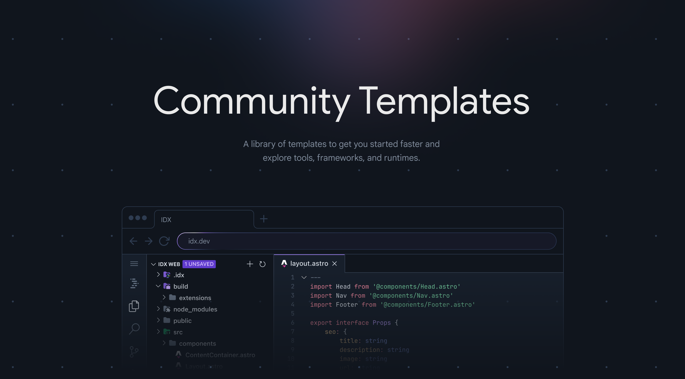

<h1 align="center">Project IDX Community Templates</h1>
<div align="center">A library of templates to get you started faster and explore tools, frameworks, and runtimes.</div>



**Note:** This repository is stores non-official, non-supported, templates for IDX workspaces.

## Add your custom IDX template
Project IDX allows anyone [to make custom workspaces through custom templates](https://developers.google.com/idx/guides/custom-templates). They require a few specific files that instruct Project IDX what to do when a workspace is being created.

### Clone and create your own folder
First clone the repository down and make your own folder for your template.

```
git clone https://github.com/project-idx/community-templates
mkdir <your-template-path> && cd $_
```

Create the necessary files for the template: `idx-template.json` and `idx-template.nix`. 

### Testing
Test your changes with the template CLI or through a template URL such as https://idx.google.com/new?template=<github-url>.

### Add an Open in IDX Button
Check out the ["Open in IDX Button Generator"](https://developers.google.com/idx/guides/open-in-idx) tool in our documentation.

### Create a PR
Once you have a tested template with an Open in IDX button, create a PR and request review.
