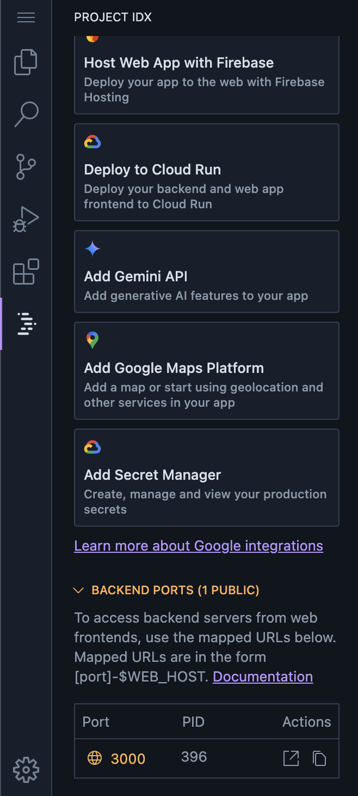
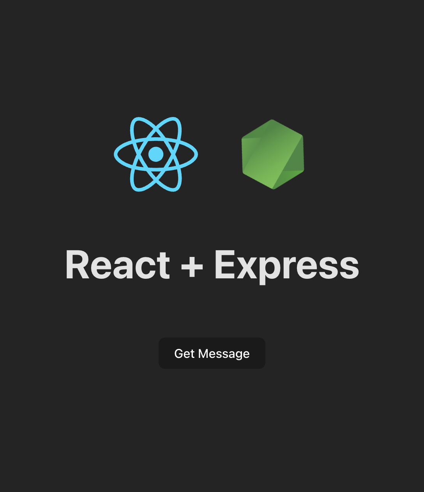

## Mono-Repo
A one-click template for a Mono repository setup inside Project IDX

## Created By
[Srivats](https://github.com/srivats22)


<a href="https://idx.google.com/new?template=https%3A%2F%2Fgithub.com%2Fsrivats22%2Fmono-idx">
  <picture>
    <source
      media="(prefers-color-scheme: dark)"
      srcset="https://cdn.idx.dev/btn/open_dark_32.svg">
    <source
      media="(prefers-color-scheme: light)"
      srcset="https://cdn.idx.dev/btn/open_light_32.svg">
    
  </picture>
</a>

## Getting Started
1. Click the IDX menu button on the left-hand side
2. Make the backend port a public Port


3. Open either ```client/src/App.js``` or ```client/src/App.tsx``` based on the template you choose
4. Replace line 10 with the Public Port URL
5. Click the Button in the preview to ensure everything is working as expected
6. You should see the message ```Hello World!``` if the api connection is successful

